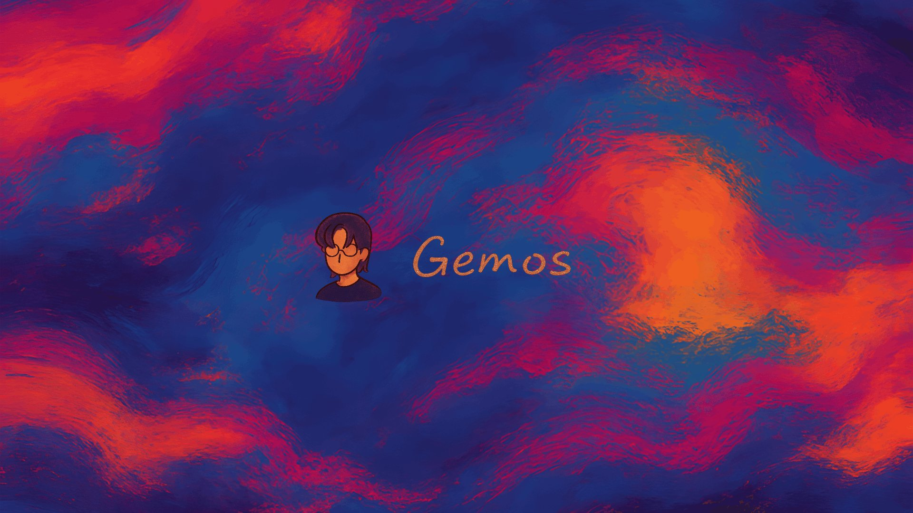

<div align="center">



### 多多 Gemos 的个人作品与创作空间

一个由代码、设计与想象力搭起来的地方 —— 记录作品、奖项、手账、实验，以及那些天马行空的小玩意。

<a href="https://gemosdodo.art"></a>
&nbsp;

&nbsp;

&nbsp;


</div>

---

## 目录

- [这是什么](#-这是什么)
- [核心特点](#-核心特点)
- [页面板块](#-页面板块)
- [两个明星页面](#-两个明星页面)
- [技术架构](#-技术架构)
- [数据模型](#-数据模型)
- [API 一览](#-api-一览)
- [本地运行](#-本地运行)
- [环境变量](#-环境变量)
- [部署](#-部署)
- [目录结构](#-目录结构)

---

## ✦ 这是什么

**Gemos（多多）个人网站** —— 不是模板，不是脚手架，而是一个真正在线运行的个人创作站点，线上地址 **[gemosdodo.art](https://gemosdodo.art)**。

从一个想法开始，用 React 一点点手写出来：**中英双语切换**、**桌面 / 平板 / 手机三套独立布局**（不是简单的响应式缩放，而是各自设计的排版与交互），暖橘配色贯穿始终。这里既是作品陈列馆，也是可以随手记录、随手玩的地方 —— 你可以正经浏览奖状与作品集，也能溜进「牛牛牧场」撒把草料喂喂牛。

网站最初脱胎于 Google AI Studio 生成的原型，之后被彻底重构、逐页重写成现在这套完整的前后端应用。

## ✦ 核心特点

- 🌏 **中英双语** —— 全站文案一键切换，内容层面区分 `titleZh / titleEn`、`descriptionZh / descriptionEn` 双字段。
- 📱 **三端独立布局** —— 通过 `body.layout-desktop / layout-phone / layout-tablet` 分流，桌面与手机是两套各自设计的界面，而非等比缩放。
- 🎨 **统一暖橘视觉** —— 强调色随深浅模式切换（深色 `#FF9500` / 浅色 `#E07B00`），字体走 SF Pro，动效讲究「高级、克制」。
- 🌗 **跟随系统深浅** —— 部分页面（如浏览器实验展厅）依据 `prefers-color-scheme` 自动切换暖白 / 近黑双主题。
- 🕹️ **可玩的交互** —— 不止于展示：牧场是 rAF 驱动的实时模拟小世界，实验展厅带成套入场 / hover / 弹窗动效。
- 🗄️ **无数据库架构** —— 所有内容以 JSON 文件持久化，图片存于 `/uploads`，写操作由管理员密钥保护。
- 🚀 **推送即部署** —— `git push` 到 GitHub 后，服务器守护进程自动拉取、构建、重启，约 45–90 秒上线。

## ✦ 页面板块

前端路由**不是**标准的 React Router `<Routes>`，而是基于 `location.pathname` 做布尔判断分发到对应页面组件。

| 板块 | 路径 | 说明 |
| :-- | :-- | :-- |
| 🏠 **首页** | `/` | 粒子背景 + 站主介绍 + 时间线；桌面端右上角有一排快捷入口（牛牛牧场 · 奖状 · 作品集 · 手账 · 实验展厅） |
| 🏆 **奖状墙** | `/awards` | 一路走来的奖项与荣誉，支持缩略图与大图查看 |
| 🖼️ **作品集** | `/pdfs` | 设计 / 文档类作品，内置基于 pdf.js 的阅读器，带封面 |
| 📔 **手账** | `/journal` | 随手记录的日常与灵感碎片，图文混排 |
| 🧪 **浏览器实验展厅** | `/vibecoding` | 用代码写成的可分享互动实验（黑洞编辑器、高斯泼溅查看器等），极简双模式网格 |
| 🐮 **牛牛牧场** | `/pasture` | 实时模拟小世界：牛自主漫步、撒草料投喂、昼夜天气循环、环境小动物 |
| 📄 **提案** | `/proposal` | 可批注的提案 PDF，批注持久化保存 |
| ⚙️ **后台** | `/admin` | 密钥保护的内容管理台，统一增删改所有内容 |

## ✦ 两个明星页面

### 🐮 牛牛牧场 `/pasture`

从「静态贴图」彻底重写成了一个 **`requestAnimationFrame` 驱动的实时小世界**，每只牛都是一个有自主 AI 的智能体（位置每帧直接写入 DOM，不触发 React 重渲染，牛多也不卡）：

- **真·自由漫步** —— 每只牛自主选目标点 → 朝它走（走路时身体起伏、按方向自动左右翻转）→ 到达后低头吃草 / 发呆 → 再换目标；近处的牛大、远处的牛小（深度缩放）。
- **撒草料投喂** —— 点草地任意处撒下草料 🌾，附近的牛加速跑来啄食，头顶冒 ❤️ / 😋 表情，右上角「已投喂」计数累加，草料吃完自动消失。
- **昼夜天气循环** —— 天空在 白天 ☀️ → 黄昏 🌅 → 夜晚 🌙 → 清晨 🌄 间缓慢渐变；夜里有月亮（带环形山）、星空与飘飞的萤火虫。
- **氛围与心情** —— 偶尔有飞鸟 🐦 / 蝴蝶 🦋 / 兔子 🐇 穿场；牛牛有心情系统（刚喂过更鲜亮、久未喂会发蔫、鼠标靠近时扭头看你）；点击任意牛弹出它的留言气泡卡片。

### 🧪 浏览器实验展厅 `/vibecoding`

极简、**跟随系统深浅自动切换**（暖白 `#F6F5F1` / 近黑 `#0C0B09`）的等宽卡片网格，配了整套顶级动效：

- **入场 stagger** —— 卡片按序错峰淡入上浮。
- **hover 微交互** —— 卡片上浮、封面轻微放大、标题变强调色、右上角箭头浮现。
- **详情弹窗过渡** —— 遮罩渐显 + 面板放大进场，关闭有对应退出动画。
- **滚动渐显** —— `IntersectionObserver` 观察进视口触发，`prefers-reduced-motion` 下自动降级。

## ✦ 技术架构

| 层 | 选型 |
| :-- | :-- |
| **前端框架** | React 19 · React Router 7 · TypeScript 5 |
| **构建工具** | Vite 6 |
| **样式** | Tailwind CSS 4 + 手写 `index.css`（全站样式与所有动画） |
| **动效** | Motion + 手写 `requestAnimationFrame` 实时模拟（牛牛牧场） |
| **后端** | Node.js + Express（RESTful API，约 3200 行的单文件 `server.js`） |
| **数据持久化** | JSON 文件（无数据库） |
| **文件上传** | multer，静态服务 `/uploads` |
| **访客统计** | ip2region 离线库做地域解析 |
| **PDF 渲染** | pdf.js |
| **进程管理** | PM2（后端常驻 `:3001`） |
| **反向代理** | Nginx |

**开发时的端口划分**：前端 Vite 开发服务器跑在 `:3000`，后端 Express API 跑在 `:3001`，前端 `/api` 请求代理到 3001。

## ✦ 数据模型

网站**没有数据库**，全部内容以仓库根目录下的 JSON 文件持久化：

| 文件 | 内容 |
| :-- | :-- |
| `data.json` | 主数据库，顶层键：`assets`（作品集）· `cows`（牛牛）· `timeline`（时间线）· `awards`（奖状）· `pdfs` · `journals` · `adminMeta`（后台元信息） |
| `vibecoding-projects.json` | 浏览器实验展厅的项目列表（slug / 标题 / 封面 / 入口路径等） |
| `proposal-annotations.json` | 提案页的批注数据 |
| `visitor_stats.json` | 访客统计（含地域） |
| `metadata.json` | 站点元信息 |

图片、PDF、视频等媒体文件统一存放在 `/uploads`（不入库，仅在 JSON 中记录相对路径）。

## ✦ API 一览

后端约 40 个接口。**读接口**公开；带 `/api/admin/*` 前缀或所有写操作（POST / PUT / DELETE）均由管理员密钥中间件（`ADMIN_SECRET`）保护。

<details>
<summary><b>点击展开完整接口列表</b></summary>

**公开读取**

```
GET  /api/data                     全站主数据
GET  /api/awards                   奖状列表
GET  /api/pdfs                     作品集列表
GET  /api/journals                 手账列表
GET  /api/journals/:id             单篇手账
GET  /api/assets                   作品集资源
GET  /api/vibecoding               实验展厅项目列表
GET  /api/vibecoding/:slug         单个实验项目
GET  /api/proposal/annotations     提案批注
GET  /api/visit/ping               访客打点
```

**内容写入 / 修改（需密钥）**

```
POST   /api/awards                 新增奖状
PUT    /api/awards/:id             修改奖状
DELETE /api/awards/:id             删除奖状
POST   /api/awards/upload          上传奖状图
POST   /api/awards/thumbnail       生成缩略图

POST   /api/pdfs                   新增作品
PUT    /api/pdfs/:id               修改作品
DELETE /api/pdfs/:id               删除作品
POST   /api/pdfs/upload            上传 PDF
POST   /api/pdfs/cover-upload      上传封面

POST   /api/timeline               新增时间线
PUT    /api/timeline/:id           修改时间线
DELETE /api/timeline/:id           删除时间线
POST   /api/timeline/thumbnail     时间线缩略图
POST   /api/timeline/video-upload  时间线视频上传

POST   /api/cows                   新增牛牛
DELETE /api/cows/:id               删除牛牛

POST   /api/assets/upload          上传作品集资源
DELETE /api/assets/:assetId        删除资源

PUT    /api/proposal/annotations   保存提案批注
```

**后台专用（需密钥）**

```
POST   /api/admin/auth/verify           校验后台密钥
POST   /api/admin/journals              新增手账
PUT    /api/admin/journals/:id          修改手账
DELETE /api/admin/journals/:id          删除手账
POST   /api/admin/journals/upload       手账图片上传
POST   /api/admin/vibecoding            新增实验项目
PUT    /api/admin/vibecoding/:id        修改实验项目
DELETE /api/admin/vibecoding/:id        删除实验项目
GET    /api/admin/vibecoding/imports    可导入的实验项目
GET    /api/admin/local-import/files    本地导入文件列表
GET    /api/admin/stats/visitors        访客统计
GET    /api/admin/storage/audit         存储空间审计
POST   /api/admin/storage/cleanup       清理无用文件
```

</details>

## ✦ 本地运行

**环境要求：** Node.js 18+

```bash
# 1. 安装依赖
npm install

# 2. 配置环境变量（见下方「环境变量」，复制为 .env.local）

# 3. 启动
npm run dev       # 仅前端开发服务器（:3000）
npm run server    # 仅后端 API（:3001）
npm start         # 前后端一起起（start.js）

# 其他
npm run build     # 生产构建
npm run preview   # 预览生产构建
npm run lint      # tsc 类型检查（--noEmit）
npm run clean     # 清空 dist
```

## ✦ 环境变量

在项目根目录创建 `.env.local`：

| 变量 | 说明 | 默认 |
| :-- | :-- | :-- |
| `GEMINI_API_KEY` | Gemini API Key | — |
| `ADMIN_SECRET` | 后台写接口的鉴权密钥 | — |
| `MAX_UPLOAD_MB` | 单文件上传上限（MB） | `10` |

## ✦ 部署

采用「**推送即部署**」的链路：

1. 本地执行 `npm run deploy "提交说明"` —— 脚本自动 `git add` + `commit` + `push` 到 GitHub `main` 分支。
2. 服务器上的 autodeploy 守护进程每 45–90 秒轮询一次，检测到新提交后自动 `git pull`、`npm build`、`pm2 restart`。
3. 约 1–2 分钟后线上生效，可通过 dist 资源 hash 变化确认部署完成。

> 服务器为阿里云轻量应用服务器，宝塔面板 + Nginx 反向代理，PM2 常驻后端进程。

## ✦ 目录结构

```
gemosdodoweb/
├─ src/                      前端源码
│  ├─ App.tsx                主壳 + 路由分发（基于 pathname）
│  ├─ AdminStudio.tsx        后台管理（最大的组件）
│  ├─ AwardsPage.tsx         奖状墙
│  ├─ PdfsPage.tsx           作品集
│  ├─ JournalPage.tsx        手账
│  ├─ VibecodingPage.tsx     浏览器实验展厅（极简双模式）
│  ├─ PasturePage.tsx        牛牛牧场（rAF 实时模拟）
│  ├─ ProposalPdfPage.tsx    提案（可批注）
│  ├─ ParticleBackdrop.tsx   首页粒子背景
│  ├─ script.ts              首页核心逻辑（initApp）
│  ├─ adminApi.ts            前端 API 封装
│  └─ index.css              全站样式与全部动画
├─ server.js                 Express 后端（约 3200 行）
├─ start.js                  前后端一起启动
├─ scripts/deploy.mjs        一键部署脚本
├─ data.json                 主数据库（JSON 持久化）
├─ vibecoding-projects.json  实验展厅数据
├─ proposal-annotations.json 提案批注数据
├─ visitor_stats.json        访客统计
├─ public/                   静态资源
├─ uploads/                  上传的媒体文件（图片/PDF/视频）
└─ docs/                     文档与 README 图片资源
```

---

<div align="center">


**Made with 🧡 by 多多 Gemos**

[gemosdodo.art](https://gemosdodo.art)

</div>
